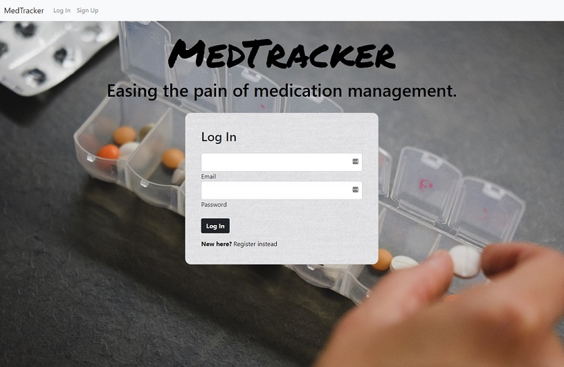
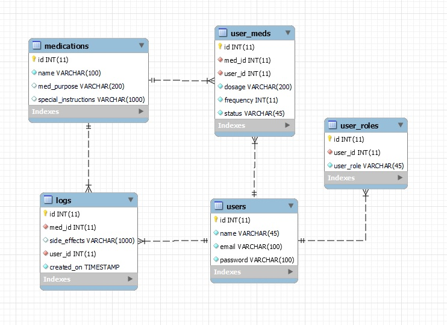

# MedTracker

## Description
I have created an application that helps users track their medications and then they take them. A user can create an account, add medications to their profile, and log when they take their medications. They can change their dosage and frequency of their medication or remove it from their list when they are no longer taking it. The app allows for the special admin privileges of searching all the medications the database and adding a new one. 

## Table of Contents

- [Usage](#usage)
- [Database](#database)
- [License](#license)
- [Links](#links)
- [Technologies](#technologies)
- [Contributors](#contributors)
- [Questions](#questions)

## Usage
To start using the application, the user should create an account by clicking on the "Sign Up" button on the homepage. 

## Database
This is an ER diagram of the database structure:

## License
This project licensed under the [MIT License](https://opensource.org/licenses/MIT).

## Links
The GitHub repository for this application can be found at [here](https://github.com/ljhofer/MedTracker).

## Technologies
HTML, CSS, Bootstrap, JavaScript, jQuery, Java, Spring, Lombok, Junit, SLF4J, MariaDB, Spring, Hibernate, JPA, Maven, Tomcat, JSP

Images are sourced from Unsplash.

## Questions
Please contact me at ljhofer@gmail.com with any questions. 

